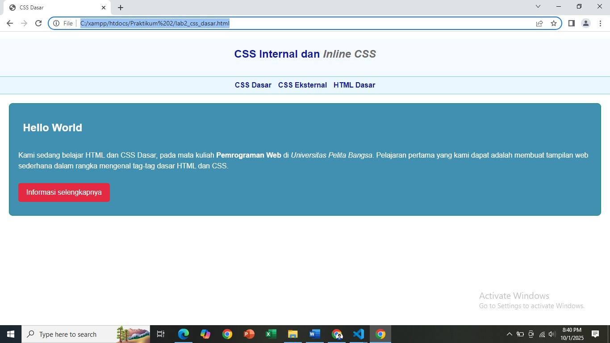
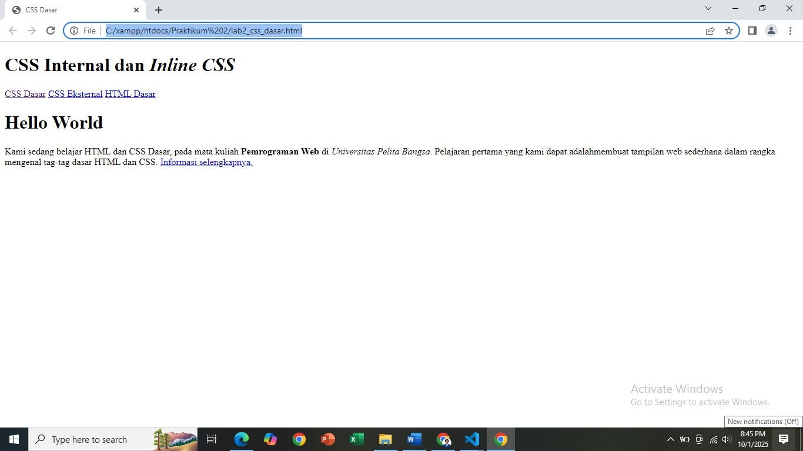
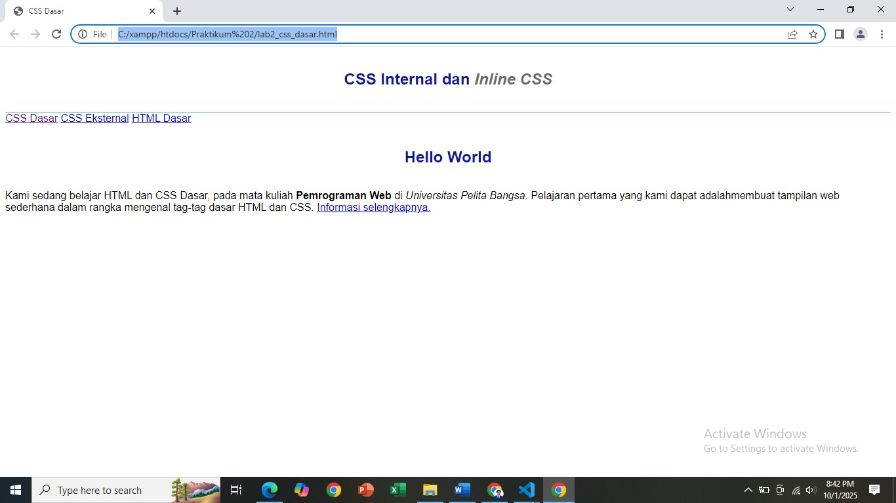

# Belajar HTML & CSS Dasar

**Nama**  : Muhammad Hafizh Alfauzi  
**NIM**   : 312410501  
**Kelas** : TI.24.A5  

---

## 📷 Hasil Keselruhan



---

## 📖 Deskripsi Proyek

Proyek ini merupakan latihan **HTML dan CSS dasar** pada mata kuliah *Pemrograman Web* di Prodi Teknik Informatika Universitas Pelita Bangsa.  
Tujuan utama dari latihan ini adalah memahami penggunaan **tag-tag dasar HTML** dan penerapan **CSS internal & class selector** untuk membuat halaman web sederhana.

---

## 🔎 Elemen yang Digunakan
Halaman web ini menampilkan beberapa elemen dasar, di antaranya:
- **Heading** (`<h1>`, `<h2>`, dll.)
- **Paragraf** (`<p>`)
- **Teks dengan format khusus** (tebal, miring, highlight)
- **Gambar** (``)
- **Hyperlink** (`<a>`)
- **Navigasi** (`<nav>`)
- **CSS Internal & ID/Class Selector**

  ---

## Step by Step
Tugas ini deikerjakan melalui beberapa step yaitu:
1. Membuat dokumen HTML
Membuat dokumen HTML seperti berikut


2. Mendeklarasikan CSS Internal
Kemudian menambahkan deklarasi CSS internal seperti berikut pada bagian head dokumen.


5. Menambahkan CSS Selector
Selanjutnya menambahkan CSS Selector menggunakan ID dan Class Selector. Pada file
style_eksternal.css, tambahkan kode berikut.


---

## 🧑‍💻 Source Code

```html
<!DOCTYPE html>
<html lang="id">
<head>
  <meta charset="UTF-8">
  <meta name="viewport" content="width=device-width, initial-scale=1.0">
  <title>CSS Dasar</title>
  <style>
    /* Global Style */
    body {
      font-family: 'Open Sans', sans-serif;
      margin: 0;
      padding: 0;
    }

    header {
      min-height: 80px;
      border-bottom: 1px solid #77CCEF;
      background: #f4faff;
    }

    h1 {
      font-size: 24px;
      color: #0F189F;
      text-align: center;
      padding: 20px 10px;
    }

    h1 i {
      color: #6d6a6b;
    }

    nav {
      display: flex;
      gap: 15px;
      justify-content: center;
      padding: 10px;
      background: #eaf7ff;
      border-bottom: 1px solid #77CCEF;
    }

    nav a {
      text-decoration: none;
      color: #0F189F;
      font-weight: 600;
    }

    nav a:hover {
      color: #E42A42;
    }

    /* ID Selector */
    #intro {
      background: #418fb1;
      border: 1px solid #099249;
      min-height: 100px;
      padding: 20px;
      margin: 20px;
      border-radius: 8px;
    }

    #intro h1 {
      text-align: left;
      border: 0;
      color: #fff;
      margin: 0 0 10px;
    }

    #intro p {
      color: #fff;
      line-height: 1.5;
    }

    /* Class Selector */
    .button {
      padding: 12px 18px;
      background: #bebcbd;
      color: #fff;
      display: inline-block;
      margin: 10px 0;
      text-decoration: none;
      border-radius: 5px;
      transition: background 0.3s ease;
    }

    .button:hover {
      background: #999;
    }

    /* Tombol utama */
    .btn-primary {
      background: #E42A42;
    }

    .btn-primary:hover {
      background: #c51d32;
    }
  </style>
</head>
<body>
  <header>
    <h1>CSS Internal dan <i>Inline CSS</i></h1>
  </header>

  <nav>
    <a href="lab2_css_dasar.html">CSS Dasar</a>
    <a href="lab2_css_eksternal.html">CSS Eksternal</a>
    <a href="lab1_tag_dasar.html">HTML Dasar</a>
  </nav>

  <div id="intro">
    <h1>Hello World</h1>
    <p>Kami sedang belajar HTML dan CSS Dasar, pada mata kuliah 
      <b>Pemrograman Web</b> di 
      <i>Universitas Pelita Bangsa</i>. 
      Pelajaran pertama yang kami dapat adalah membuat tampilan web sederhana dalam rangka mengenal tag-tag dasar HTML dan CSS.
    </p>
    <a class="button btn-primary" href="#intro">Informasi selengkapnya</a>
  </div>
</body>
</html>


```

Sekian, Terima Kasih
